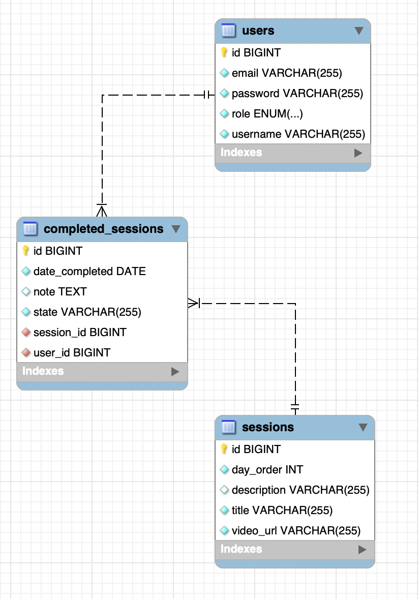
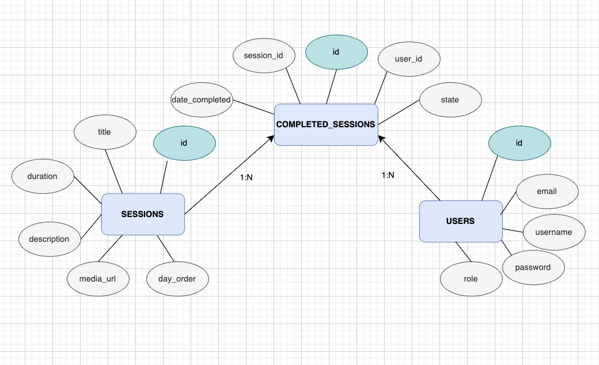

# Yogi15MinTrack API

**Yogi15MinTrack** is a backend application that helps users stay consistent with short daily yoga practice.  
The app provides a collection of 15-minute sessions, allows users to mark them as completed, and record their wellness state after practice.  
Users register and log in with JWT-based authentication. Roles **USER** and **ADMIN** define access (e.g., only admins can manage the sessions list).

---

## Features

### User
- Registration & Login (with password validation, JWT token)
- View available yoga sessions
- Mark sessions as completed
- Record personal wellness state after each session
- Manage own profile (view, update, delete)

### Admin
- Manage yoga sessions (CRUD: create, update, delete)
- Manage users (add admin, view all users, delete users)

### Security
- JWT-based authentication
- Role-based authorization (USER / ADMIN)
- Spring Security configuration with filters

### Documentation
- **Swagger UI** for API testing

---

##  Tech Stack

- **Backend**: Java 21, Spring Boot 3
- **Security**: Spring Security + JWT
- **Database**: MySQL
- **ORM**: Spring Data JPA / Hibernate
- **DevOps**: Docker, Docker Compose
- **Documentation**: OpenAPI (Swagger UI)
- **Tools**: IntelliJ IDEA, GitHub

---

## Project Structure

```
yogi15mintrack
├── .idea / .mvn                         
├── src
│   ├── main
│   │   ├── java/com.yogi15mintrack
│   │   │   ├── Yogi15mintrackApplication.java     
│   │   │
│   │   │   ├── completedSessions
│   │   │   │   ├── dto
│   │   │   │   │   ├── CompletedCreateRequest.java
│   │   │   │   │   ├── CompletedResponse.java
│   │   │   │   ├── CompletedSession.java
│   │   │   │   ├── CompletedSessionController.java
│   │   │   │   ├── CompletedSessionRepository.java
│   │   │   │   ├── CompletedSessionService.java
│   │   │   │   └── Mood.java                           
│   │   │
│   │   │   ├── sessions
│   │   │   │   ├── dto
│   │   │   │   │   ├── SessionCreateRequest.java
│   │   │   │   │   ├── SessionUpdateRequest.java
│   │   │   │   │   └── SessionResponse.java
│   │   │   │   ├── Session.java
│   │   │   │   ├── SessionController.java
│   │   │   │   ├── SessionRepository.java
│   │   │   │   └── SessionService.java
│   │   │
│   │   │   ├── users
│   │   │   │   ├── dto
│   │   │   │   │   ├── UserLoginRequest.java
│   │   │   │   │   ├── UserRegisterRequest.java
│   │   │   │   │   ├── UserResponse.java
│   │   │   │   │   ├── UserResponseShort.java
│   │   │   │   │   └── UserMapper.java
│   │   │   │   ├── Role.java                            
│   │   │   │   ├── User.java
│   │   │   │   ├── UserController.java
│   │   │   │   ├── UserRepository.java
│   │   │   │   └── UserService.java
│   │   │
│   │   │   ├── config
│   │   │   │   ├── CloudinaryConfig.java
│   │   │   │   ├── DataSeeder.java
│   │   │   │   ├── DefaultAdminInitializer.java
│   │   │   │   ├── OpenApiConfig.java
│   │   │   │   └── SecurityConfig.java
│   │   │
│   │   │   ├── exceptions
│   │   │   │   ├── EntityAlreadyExistsException.java
│   │   │   │   └── EntityNotFoundException.java
│   │   │
│   │   │   ├── security
│   │   │   │   ├── jwt
│   │   │   │   │   ├── JwtAuthFilter.java
│   │   │   │   │   ├── JwtService.java
│   │   │   │   │   ├── JwtResponse.java
│   │   │   │   ├── AuthController.java
│   │   │   │   ├── CustomUserDetail.java
│   │   │   │   └── JwtResponse.java
│   │
│   │   └── resources
│   │       ├── application.yaml
│   │       ├── application-docker.yaml
│   │       ├── static
│   │       └── templates
│
│   └── test/java/com.yogi15mintrack
│       ├── completedSessions
│       │   └── CompletedSessionServiceTest.java
│       ├── security
│       │   ├── AuthControllerTest.java
│       │   └── JwtServiceTest.java
│       ├── sessions
│       │   ├── SessionControllerTest.java
│       │   └── SessionServiceTest.java
│       ├── users
│       │   ├── UserControllerTest.java
│       │   └── UserServiceTest.java
│       └── Yogi15mintrackApplicationTests.java
│
├── docker-compose.yml
├── Dockerfile
├── .env
├── .dockerignore
├── .gitignore
├── .gitattributes

```
---

##  Getting Started

### Run locally with Docker

```bash
# Clone the repository
git clone https://github.com/roz-mari/yogi15mintrack.git
cd yogi15mintrack

# Build and start with Docker Compose
docker compose up -d --build

## Profiles

- `application.yaml` — local development  
- `application-docker.yaml` — Docker container profile  
```
---

## Swagger UI

- [http://localhost:8082/swagger-ui/index.html](http://localhost:8082/swagger-ui/index.html)

---

## Authentication Flow

1. Register a new user via `/auth/register`  
2. Log in via `/auth/login`  
3. Copy the JWT token from the login response  
4. In Swagger UI → click **Authorize** → paste `Bearer <your-token>`  
5. Access protected endpoints (e.g., `/sessions`)  

---

## Endpoints Overview

### Auth

| Method | Endpoint           | Description               | Access  |
|--------|--------------------|---------------------------|---------|
| POST   | `/auth/register`   | Register a new USER       | Public  |
| POST   | `/auth/login`      | Login and get JWT token   | Public  |
| POST   | `/users/admin`     | Create ADMIN              | Admin   |

---

### Users

| Method | Endpoint       | Description            | Access  |
|--------|----------------|------------------------|---------|
| GET    | `/users/me`    | View own profile       | User    |
| PUT    | `/users/me`    | Update profile         | User    |
| DELETE | `/users/me`    | Delete own account     | User    |

---

### Sessions

| Method | Endpoint              | Description              | Access  |
|--------|-----------------------|--------------------------|---------|
| GET    | `/sessions`           | Get all yoga sessions    | User    |
| GET    | `/sessions/today`     | Get today’s session      | User    |
| POST   | `/sessions`           | Create new session       | Admin   |
| PUT    | `/sessions/{id}`      | Update a session by ID   | Admin   |
| DELETE | `/sessions/{id}`      | Delete a session by ID   | Admin   |

---

### Completed Sessions

| Method | Endpoint                | Description                    | Access  |
|--------|-------------------------|--------------------------------|---------|
| POST   | `/completed`            | Mark a session as completed    | User    |
| GET    | `/completed`            | Get all completed sessions     | User    |
| GET    | `/completed/today`      | Get today’s completed session  | User    |
| GET    | `/streaks`              | Get user streaks               | User    |

---

### Admin Endpoints

| Method | Endpoint            | Description                    | Access  |
|--------|---------------------|--------------------------------|---------|
| GET    | `/users`            | Get all users                  | Admin   |
| GET    | `/users/{id}`       | Get user by ID                 | Admin   |
| DELETE | `/users/{id}`       | Delete user by ID              | Admin   |

---

## Tests
- Unit and Integration tests for:
  - `AuthController`
  - `JwtService`
  - `UserController` & `UserService`
  - `SessionController` & `SessionService`
  - `CompletedSessionService`

 Goal: **70%+ test coverage**  
[Tests.png](assets/images/Tests.png)s)

---

## Diagrams
- ER Diagram  
- Database Diagram  
- Flow Diagram  




---

## Docker
- Multi-stage **Dockerfile** (Maven → JRE)  
- **docker-compose.yml** includes:
  - MySQL (port `3307`)
  - Application (port `8082`)

---

## Author
Developed as part of **Backend + DevOps Bootcamp**  
by [Mariia Sycheva](https://github.com/roz-mari) 